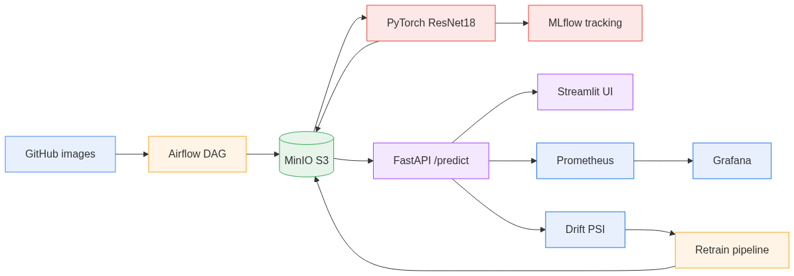

# MLOps Dandelion Classifier - GreenGuard

[](https://github.com/enzoberreur/ml-ops-dandelion-classifier/actions/workflows/ci_cd.yml) [](https://codecov.io/gh/enzoberreur/ml-ops-dandelion-classifier)

End-to-end, industrialised AI solution that classifies a plant photo as
**dandelion** (weed) or **grass** (crop/turf), built as the deliverable for
**Bloc 4 - Artificial Intelligence Solutions**. It is not just a model: it is a
closed MLOps loop - data pipeline, experiment tracking, a serving API, CI/CD,
production monitoring with **data-drift detection**, and **automated
(drift-triggered) retraining**.

**Authors:** Enzo Berreur · Elea Nizam · Jean-Baptiste Brun · Elisa Leclerc

> **For the jury:** [`docs/EVALUATION.md`](docs/EVALUATION.md) maps every grading criterion to where it is proven, and [`docs/DEFENSE.md`](docs/DEFENSE.md) is the oral Q&A pack.

> **Business framing (GreenGuard):** the perception brain and MLOps platform for
> **autonomous, chemical-free weeding robots**. As herbicides are banned (e.g.
> France's Loi Labbe) and manual weeding stays scarce, robots weed mechanically -
> but must tell a weed (dandelion) from the crop/turf (grass) in real time to
> remove only the weed. Across sites and seasons the data drifts, so the model is
> monitored and retrained automatically. Full
> [cahier des charges](docs/SPECIFICATION.md).

## Deliverables (this repo)

| Deliverable | Location |
|---|---|
| AI solution presentation (18 slides) | [`deliverables/presentation.pptx`](deliverables/presentation.pptx) |
| Specification (cahier des charges) | [`deliverables/cahier_des_charges.docx`](deliverables/cahier_des_charges.docx) · [source](docs/SPECIFICATION.md) |
| ML model code | [`models/`](models/), [`notebooks/`](notebooks/) |
| Deployment & CI/CD code | [`app/api/`](app/api/), [`k8s/`](k8s/), [`monitoring/`](monitoring/), [`retrain/`](retrain/), [`.github/workflows/`](.github/workflows/) |
| Demo video script (5 min) | [`docs/LOOM_SCRIPT.md`](docs/LOOM_SCRIPT.md) |
| Model card | [`docs/MODEL_CARD.md`](docs/MODEL_CARD.md) |
| Structure ↔ brief mapping | [`docs/PROJECT_STRUCTURE.md`](docs/PROJECT_STRUCTURE.md) |

## Stack

- **Orchestration:** Apache Airflow 2
- **Modelling:** PyTorch + torchvision - **ResNet18 transfer learning** (default) with a custom-CNN baseline
- **MLOps:** MLflow (tracking), MinIO (S3-compatible artifacts & datasets)
- **Serving:** FastAPI + Streamlit
- **Packaging:** Docker, Docker Compose, Kubernetes (Minikube)
- **CI/CD:** GitHub Actions (tests → build → deploy)
- **Monitoring:** Prometheus + Grafana (operational) + **Evidently / PSI** (data drift)

## Why these choices

- **ResNet18 transfer learning** - with only ~400 images, a pretrained backbone
  generalises far better than training from scratch. A lightweight custom CNN is
  retained as an offline baseline (`MODEL_ARCH=cnn`).
- **Airflow + MinIO** - declarative, observable pipelines and a reproducible,
  cloud-portable S3 store for data and models.
- **MLflow** - every run logs params, metrics (accuracy, **F1**, precision,
  recall), the confusion matrix and the serialized model.
- **FastAPI** - fast, stateless serving; loads the latest checkpoint from MinIO
  and exposes Prometheus metrics.
- **Evidently + PSI** - human-readable drift reports and machine-readable drift
  metrics that drive **drift-triggered retraining**.

## Architecture



| Service | Port | Role |
|---|---|---|
| Airflow | 8080 | Orchestration (data + retraining) |
| MinIO | 9000/9001 | S3 storage (data + models + artifacts) |
| MLflow | 5500 | Experiment tracking |
| FastAPI | 8000 | Prediction API (`/predict`, `/health`, `/version`, `/metrics`) |
| Streamlit | 8501 | Web UI |
| Prometheus | 9090 | Metrics collection |
| Grafana | 3000 | Dashboards (classifier, Airflow, **drift**) |

See [`docs/PROJECT_STRUCTURE.md`](docs/PROJECT_STRUCTURE.md) for the full tree and
how it maps to the brief's required folders.

## Quick start (Docker Compose)

```bash
# 1. Build the app image
docker compose build
# 2. Initialise Airflow (once)
docker compose up airflow-init
# 3. Start everything
docker compose up -d
```

Wait ~30-60 s, then open:

- Airflow - http://localhost:8080 (`admin` / `admin`)
- FastAPI - http://localhost:8000/docs
- Streamlit - http://localhost:8501
- MLflow - http://localhost:5500
- MinIO console - http://localhost:9001 (`minioadmin` / `minioadmin`)
- Prometheus - http://localhost:9090
- Grafana - http://localhost:3000 (`admin` / `admin`)

### 10-minute demo

1. In Airflow, trigger `dandelion_data_pipeline` (download → preprocess → train → push model).
2. While it runs, show **MinIO** (buckets), **MLflow** (live metrics), **Grafana** (dashboards).
3. Once trained, test in **Streamlit** or via `POST /predict` in the FastAPI docs.

```bash
# Test images
curl -o test_dandelion.jpg "https://raw.githubusercontent.com/btphan95/greenr-airflow/refs/heads/master/data/dandelion/00000001.jpg"
curl -o test_grass.jpg     "https://raw.githubusercontent.com/btphan95/greenr-airflow/refs/heads/master/data/grass/00000001.jpg"
```

> The API answers `503` on `/predict` until a model exists - run the pipeline first.

## ML model

- **Architecture:** `MODEL_ARCH=resnet18` (default) or `cnn`. The chosen arch is
  saved inside the checkpoint, so serving rebuilds the exact network.
- **Metrics:** accuracy, macro **F1**, precision, recall and the confusion matrix
  are logged to MLflow each run; the release gate is **macro-F1 ≥ 0.85**.
- **Reference run:** ~0.90 accuracy / ~0.89 macro-F1, ~4 min on CPU.
- **Notebooks:** [`notebooks/01_eda.ipynb`](notebooks/01_eda.ipynb) (EDA) and
  [`notebooks/02_model_selection.ipynb`](notebooks/02_model_selection.ipynb)
  (architecture rationale + evaluation).

```bash
# Train locally (after data is available), choosing the architecture
python models/train.py --data-dir data/processed --arch resnet18 --epochs 5
```

## Serving API

| Endpoint | Purpose |
|---|---|
| `POST /predict` | Class + per-class probabilities for an uploaded image |
| `GET /health` | Readiness + class list |
| `GET /version` | Served model metadata (architecture, source, image size) |
| `GET /metrics` | Prometheus metrics (incl. drift gauges) |

## Production monitoring

- **Operational:** `predictions_total`, `prediction_latency_seconds` (p90) on the
  *Dandelion Classifier* Grafana dashboard; Airflow metrics via StatsD.
- **Data drift:** per-feature **PSI** over interpretable image statistics
  (brightness, contrast, colour, saturation, edges). Exposed as
  `dandelion_dataset_drift`, `dandelion_drift_share`, `dandelion_feature_psi`
  gauges on the API `/metrics` endpoint (no extra service) and visualised on the
  *Dandelion Data Drift* dashboard. A human-readable report is produced by
  **Evidently** (with a dependency-free fallback). See
  [`monitoring/drift/`](monitoring/drift/).

```bash
# Reproducible drift sample (no pipeline needed)
python -m monitoring.drift.generate_sample_report      # -> monitoring/drift/reports/
# Real drift check between two image directories
python -m monitoring.drift.run_drift_check --reference data/processed --current data/incoming
# Optional: full Evidently reports
pip install -r requirements-monitoring.txt
```

## Automated retraining

Two triggers, **one drift definition** (shared with monitoring):

- **Scheduled** - monthly `dandelion_retrain_pipeline` DAG
  (`sync → check_drift → train → refresh_baseline`).
- **Drift-triggered** - retrain only when incoming data drifted vs the reference
  set. See [`retrain/`](retrain/).

```bash
# Drift-gated (retrains only if drifted)
python -m retrain.retrain --data-dir data/processed --reference-dir data/baseline
# Forced refresh
python -m retrain.retrain --data-dir data/processed --force
```

## Tests

```bash
pip install -r requirements-dev.txt
pytest            # model factory, API endpoints, drift engine, dataloaders
```

## Kubernetes (Minikube)

```bash
minikube start --driver=docker
docker build -t mlops-app:latest .
minikube image load mlops-app:latest
kubectl apply -f k8s/minikube-manifest.yaml
kubectl get svc -n mlops
```

## CI/CD (GitHub Actions)

`.github/workflows/ci_cd.yml` runs on every push to `main`:

1. **tests** - install deps and run `pytest`.
2. **build** - build the Docker image and push to GHCR.
3. **deploy** - validate the Kubernetes manifests (kubeconform, schema-checked, offline). The same manifests deploy to a local Minikube cluster (see above).

| Step | Screenshot |
|---|---|
| Unit tests |  |
| Build & push |  |
| Manifest validation |  |

## Screenshots

| View | Description |
|---|---|
|  | `dandelion-classifier` experiment - params and successful run. |
|  | Logged metric history (loss & accuracy). |
|  | Buckets with datasets and the `best_model.pt` checkpoint. |
|  | Web UI to test predictions. |
|  | Live `/predict` traffic (p90 latency, call count). |
|  | Airflow scheduler/throughput via StatsD. |

## Repository structure

```
MLops/
├── notebooks/         # EDA + model selection
├── models/            # model.py (resnet18|cnn), train.py, utils.py
├── app/api/           # FastAPI serving
├── app/webapp/        # Streamlit UI
├── airflow/dags/      # data + (drift-aware) retrain pipelines
├── retrain/           # drift-gated automated retraining
├── monitoring/        # Prometheus, Grafana dashboards, drift engine + reports
├── k8s/               # Minikube manifests
├── tests/             # unit + API + drift tests
├── docs/              # specification, model card, structure, Loom script
├── deliverables/      # presentation.pptx, cahier_des_charges.docx
├── Dockerfile · docker-compose.yml
└── .github/workflows/ci_cd.yml
```

## Notes

- Dataset: ~200 images/class fetched from a public GitHub dataset by the Airflow pipeline.
- The API auto-downloads the latest model from MinIO at startup; checkpoints store
  the architecture and class names for exact reconstruction.
- MLflow logs the model (`mlflow.pytorch.log_model`) and the best checkpoint.
